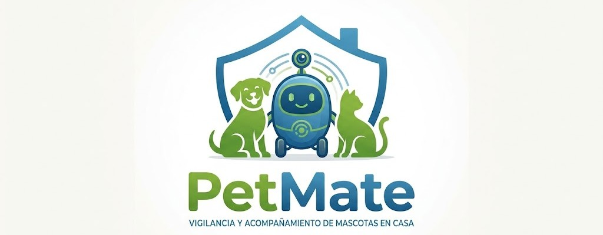

<h1> 🐾 PetMate </h1>  

[](https://www.python.org/)
[](https://www.raspberrypi.com/)
[](https://opensource.org/licenses/MIT)
[](https://ultralytics.com/)
[]()

> **Robot autónomo inteligente** para la vigilancia, seguridad y bienestar de tus mascotas cuando no estás en casa.

PetMate patrulla tu hogar de forma autónoma, detecta y clasifica el tipo de mascota, estima su pose en tiempo real, dispensa premios por buen comportamiento y te permite interactuar con ella a distancia desde una aplicación móvil.

---

## Tabla de Contenidos

1. [Descripción General](#-descripción-general)
2. [Características Principales](#-características-principales)
3. [Demo](#-demo)
4. [Arquitectura del Sistema](#-arquitectura-del-sistema)
5. [Hardware y Componentes](#-hardware-y-componentes)
6. [Software y Visión Artificial](#-software-y-visión-artificial)
7. [Algoritmo de Navegación](#-algoritmo-de-navegación)
8. [Instalación y Configuración](#-instalación-y-configuración)
9. [Estructura del Repositorio](#-estructura-del-repositorio)
10. [Referencias](#-referencias)
11. [Contribuidores](#-contribuidores)
12. [Licencia](#-licencia)

---

## Descripción General

**PetMate** es un robot móvil autónomo diseñado para monitorizar mascotas en entornos domésticos. Combina visión artificial, Deep Learning y navegación autónoma sobre una plataforma Raspberry Pi 4 para ofrecer:

- **Vigilancia continua** de tu mascota mientras no estás en casa.
- **Identificación** del tipo de animal y **clasificación de su pose** (de pie, sentado, tumbado, en movimiento).
- **Interacción remota** mediante una app móvil: visualización en directo y envío de audios.
- **Dispensación de premios** automática por buen comportamiento (p. ej., sentarse a la orden).
- **Patrullaje autónomo** con evasión de obstáculos mediante algoritmo *Wall Following*.
- **Autonomía energética** gracias a un panel solar integrado.

---

## Características Principales

| Característica | Detalle |
|---|---|
| **Detección de mascotas** | Clasificación del tipo de animal en tiempo real con modelo de Deep Learning |
| **Estimación de pose** | Detecta si la mascota está de pie, sentada, tumbada o en movimiento |
| **Navegación autónoma** | Algoritmo *Wall Following* con 3 sensores ultrasónicos HC-SR04 |
| **Evasión de obstáculos** | Detección frontal, izquierda y derecha para esquivar obstáculos dinámicos |
| **App remota** | Streaming de vídeo en directo y control de audio desde el móvil |
| **Altavoz integrado** | Reproducción de audios enviados desde la app o alertas automáticas |
| **Dispensador de premios** | Servo-actuado: dispensa una chuche cuando detecta la secuencia correcta de comportamiento |
| **Panel solar** | Recarga continua para vigilancia prolongada sin necesidad de enchufar el robot |
| **Modelo en la nube** | Inferencia y almacenamiento gestionados remotamente mediante el proyecto *PetWatch* |

---

## Demo

> 📹 **[Ver vídeo del robot en funcionamiento](#)** 

---

## Arquitectura del Sistema

```
┌─────────────────────────────────────────────────────┐
│                    APLICACIÓN MÓVIL                 │
│          (Streaming vídeo · Envío de audios)         │
└────────────────────┬────────────────────────────────┘
                     │ WiFi / Cloud (PetWatch)
┌────────────────────▼────────────────────────────────┐
│                  RASPBERRY PI 4                      │
│                                                     │
│  ┌─────────────┐   ┌──────────────┐  ┌───────────┐ │
│  │  Pi Camera  │──▶│ Deep Learning│  │  PetWatch │ │
│  │  Module 2   │   │  (Detección  │─▶│   Cloud   │ │
│  └─────────────┘   │  + Pose Est.)│  └───────────┘ │
│                    └──────┬───────┘                 │
│  ┌─────────────┐          │ Comportamiento           │
│  │ HC-SR04 ×3  │   ┌──────▼───────┐  ┌───────────┐ │
│  │ (Izq·Frente │──▶│  Navegación  │  │Dispensador│ │
│  │    ·Der.)   │   │Wall Following│  │  (Servo)  │ │
│  └─────────────┘   └──────┬───────┘  └───────────┘ │
│                           │                         │
│  ┌─────────────┐   ┌──────▼───────┐  ┌───────────┐ │
│  │ Panel Solar │   │   L298N +    │  │ Altavoz   │ │
│  │ + PowerBank │   │  2× Motores  │  │  3W       │ │
│  └─────────────┘   └──────────────┘  └───────────┘ │
└─────────────────────────────────────────────────────┘
```

---

## Hardware y Componentes

El coste total estimado del hardware es de **213,33 €**.

| Imagen | Componente | Unid. | Precio |
|:---:|:---|:---:|---:|
| 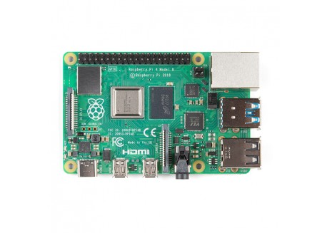 | Raspberry Pi 4 Modelo B — 8 GB RAM | 1 | 88,50 € |
| 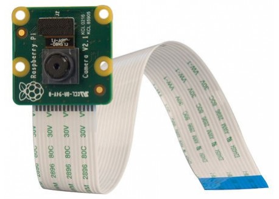 | Raspberry Pi Camera Module 2 (8 MP) | 1 | 19,95 € |
| 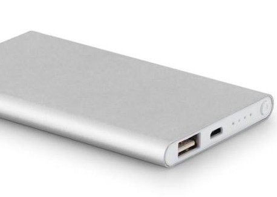 | PowerBank 10 000 mAh | 1 | 33,59 € |
| 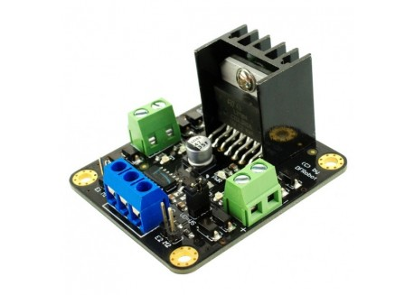 | Controlador de motores doble puente H — L298N | 1 | 15,50 € |
| 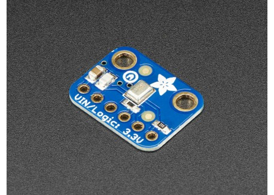 | Micrófono electret preamplificado | 1 | 9,75 € |
| 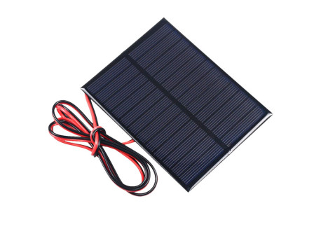 | Panel Solar 6 V / 1 W con cable | 1 | 7,90 € |
| 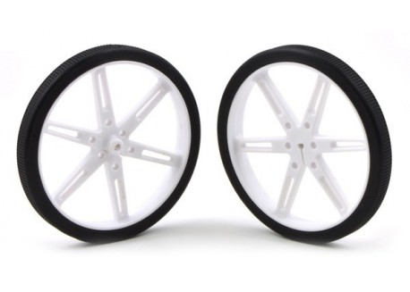 | Pareja de ruedas 80×10 mm | 1 | 7,95 € |
| 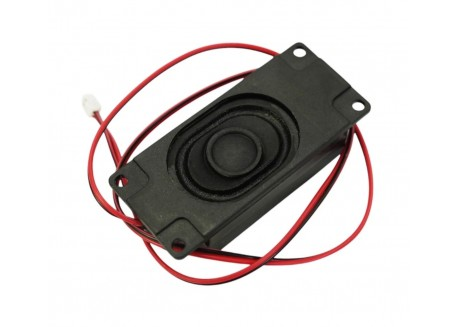 | Altavoz con caja 3 W | 1 | 5,90 € |
| 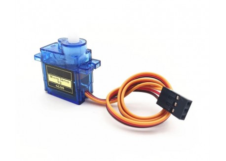 | Servo MG90S (dispensador) | 1 | 3,95 € |
| 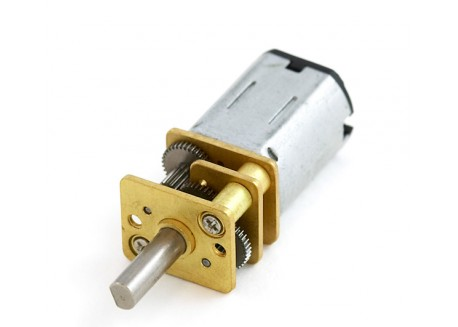 | Motor Micro Metal LP con reductora | 2 | 4,50 € |
|  | Pilas Alcalinas 4×AA | 1 | 2,99 € |
| 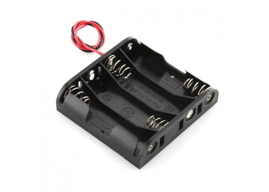 | Base para pilas 4×AA | 1 | 2,00 € |
| 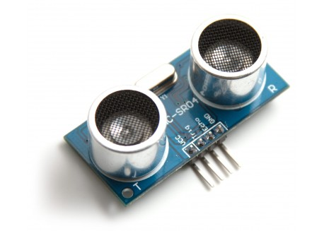 | Sensor ultrasónico HC-SR04 | 3 | 1,80 € |
| 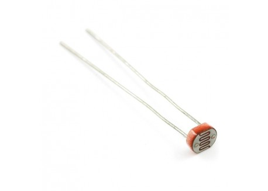 | Fotoresistor LDR | 1 | 0,95 € |
| | | **TOTAL** | **213,33 €** |

---

## Software y Visión Artificial

El pipeline de visión artificial se estructura en dos etapas en cascada:

### 1. Detección del tipo de mascota
- Modelo de detección de objetos entrenado con técnicas de **Deep Learning**.
- Procesa el flujo de vídeo en tiempo real desde la **Pi Camera Module 2**.
- Clasifica el animal detectado (perro, gato, etc.).

### 2. Estimación de pose
Una vez identificado el animal, un segundo modelo clasifica su estado postural:

| Pose | Descripción |
|---|---|
| De pie | El animal está erguido sobre sus patas |
| Sentado | El animal está sentado |
| Tumbado | El animal está estirado en el suelo |

### Infraestructura Cloud — PetWatch
El modelo de inferencia está desplegado en la nube a través del proyecto **[PetWatch](📂 PetWatch)**, que también gestiona:
- Streaming de vídeo hacia la app móvil.
- Recepción y reproducción de audios enviados por el usuario.
- Almacenamiento de eventos y alertas.

**Stack tecnológico:** *(completa aquí con los frameworks y librerías usadas, p. ej. YOLOv8, TensorFlow Lite, OpenCV, Flask…)*

---

## Algoritmo de Navegación

PetMate implementa un algoritmo de **Wall Following** para patrullar el hogar de forma estructurada:

```
┌─────────────────────────────────────────────────────────────┐
│                   LÓGICA DE NAVEGACIÓN                      │
│                                                             │
│  ┌──────────────────────────────────────────────────────┐   │
│  │ Sensor DERECHO detecta pared                         │   │
│  │                                                      │   │
│  │  · Demasiado cerca  →  Ajustar: girar a la izquierda │   │
│  │  · Distancia ideal  →  Seguir recto                  │   │
│  │  · Demasiado lejos  →  Ajustar: girar a la derecha   │   │
│  └──────────────────────────────────────────────────────┘   │
│                                                             │
│  ┌──────────────────────────────────────────────────────┐   │
│  │ Sensor FRONTAL detecta obstáculo  →  Girar izquierda │   │
│  └──────────────────────────────────────────────────────┘   │
│                                                             │
│  ┌──────────────────────────────────────────────────────┐   │
│  │ Sin pared detectada  →  Girar izquierda hasta        │   │
│  │                          encontrar pared por derecha  │   │
│  └──────────────────────────────────────────────────────┘   │
└─────────────────────────────────────────────────────────────┘
```

El robot mantiene siempre una pared a su **derecha**, recorriendo el perímetro de las habitaciones de forma sistemática. Los tres sensores HC-SR04 (frontal, izquierdo, derecho) permiten detectar y esquivar obstáculos dinámicos como muebles o personas.

---

## Instalación y Configuración

### Requisitos previos

- Raspberry Pi 4 con Raspberry Pi OS (64-bit)
- Python 3.11+
- Conexión WiFi activa

### Dependencias principales

```bash
pip install opencv-python
pip install numpy
pip install RPi.GPIO
# (añade aquí el resto de librerías del proyecto)
```

### Pasos de instalación

**1. Clonar el repositorio:**

```bash
git clone https://github.com/TU_USUARIO/PetMate.git
cd PetMate
```

**2. Instalar dependencias:**

```bash
pip install -r requirements.txt
```

**3. Configurar credenciales de la nube (PetWatch):**

```bash
cp config/config.example.yaml config/config.yaml
# Edita config.yaml con tus credenciales
```

**4. Ejecutar el robot:**

```bash
python src/main.py
```

---

## Estructura del Repositorio

```
PetMate/
│
├── 📂 3D designs/       # Modelos CAD y archivos STL de la estructura del robot
├── 📂 PetWatch/         # Módulo de visión por computador y servidor en la nube
├── 📂 circuits/         # Esquemas de conexión: L298N, sensores y Raspberry Pi
├── 📂 src/              # Código fuente Python ejecutable en la Raspberry Pi
│   ├── main.py          #   Punto de entrada principal
│   ├── navigation.py    #   Algoritmo Wall Following
│   ├── detection.py     #   Pipeline de visión artificial
│   ├── dispenser.py     #   Control del dispensador (servo)
│   └── cloud.py         #   Comunicación con PetWatch
└── 📂 resources/        # Diagramas, arquitectura, fotos de componentes
```

---

## Referencias

- *Wall Following Algorithm for Mobile Robots* — *(añade referencia académica)*
- *YOLOv8 / Deep Learning framework utilizado* — *(añade referencia)*
- [Raspberry Pi Documentation](https://www.raspberrypi.com/documentation/)
- [HC-SR04 Ultrasonic Sensor Datasheet](https://cdn.sparkfun.com/datasheets/Sensors/Proximity/HCSR04.pdf)

---

## Contribuidores

| Nombre | GitHub |
|---|---|
| Junjie Liu | [@usuario](#) |
| Joel Rillo Fernández | [@usuario](#) |
| Gerard Saez Salat | [@usuario](#) |
| Elías Pascual Paz | [@usuario](#) |

---

## Licencia

Este proyecto está bajo la licencia **MIT**. Consulta el archivo [LICENSE](LICENSE) para más detalles.

[](https://opensource.org/licenses/MIT)


