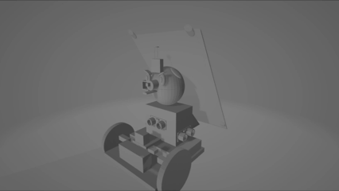
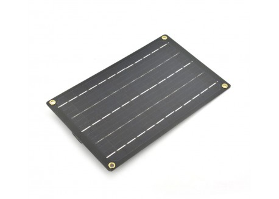
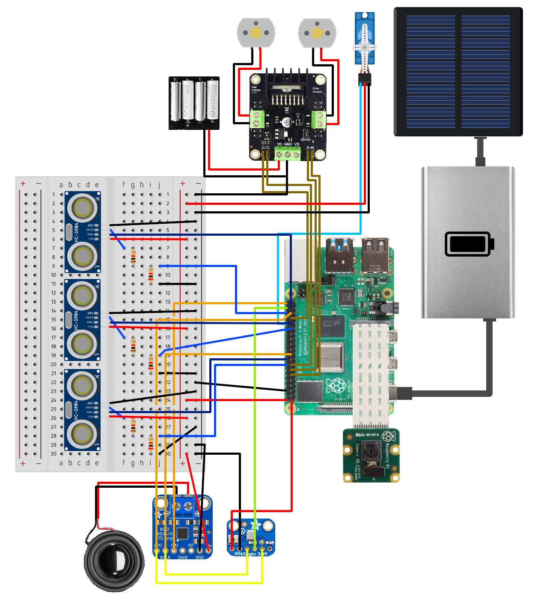
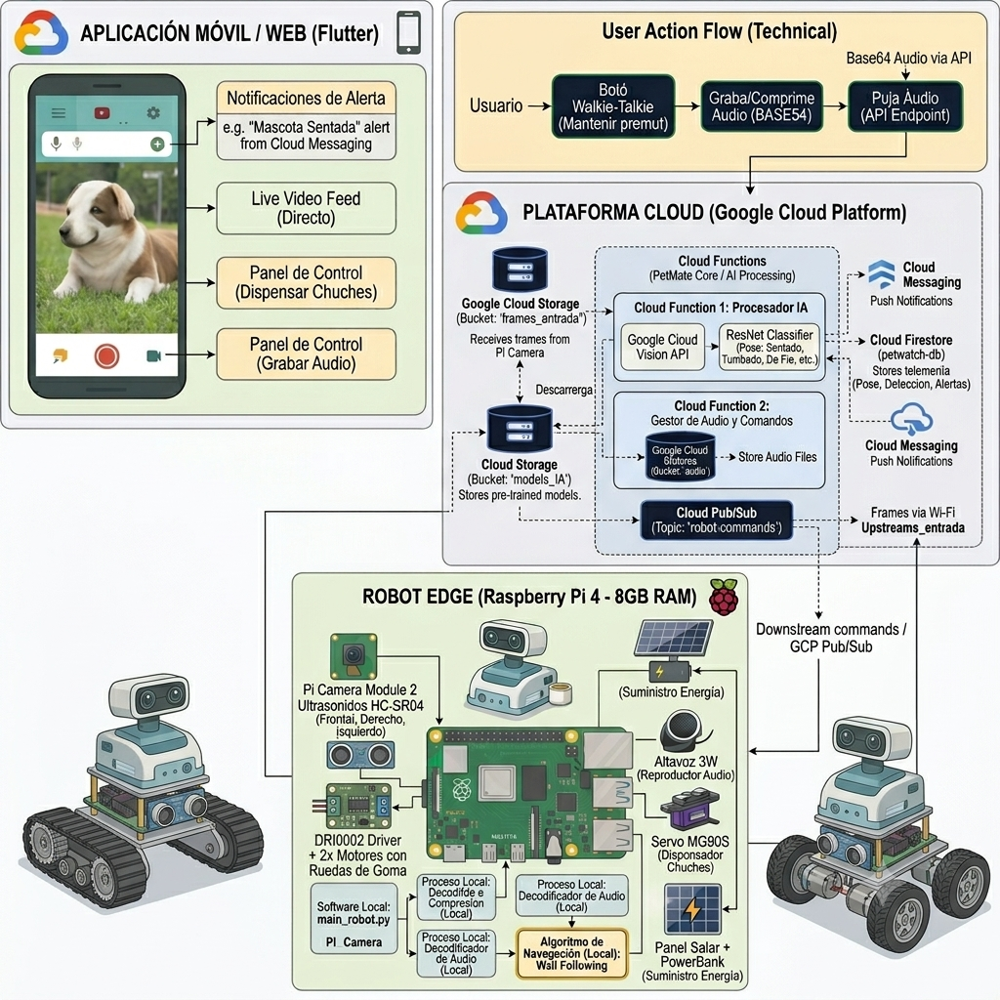

# 🐾 PetMate


[](https://www.python.org/)
[](https://www.raspberrypi.com/)
[](https://opensource.org/licenses/MIT)
[](https://ultralytics.com/)
[]()

> **Robot autónomo inteligente** para la vigilancia, seguridad y bienestar de tus mascotas cuando no estás en casa.


PetMate patrulla tu hogar de forma autónoma, detecta y clasifica el tipo de mascota, estima su pose en tiempo real, dispensa premios por buen comportamiento y te permite interactuar con ella a distancia desde una aplicación móvil.

---

## Tabla de Contenidos

1. [Descripción General](#descripción-general)
2. [Características Principales](#características-principales)
3. [Demo](#demo)
4. [Hardware y Componentes](#hardware-y-componentes)
   - [4.1. Componentes](#componentes)
   - [4.2. Arquitectura del Hardware](#arquitectura-del-hardware)
5. [Software y Visión Artificial](#software-y-visión-artificial)
   - [5.1. Arquitectura del Software](#arquitectura-del-software)
   - [5.2. Visión Artificial](#visión-artificial)
6. [Algoritmo de Navegación](#algoritmo-de-navegación)
7. [Instalación y Configuración](#instalación-y-configuración)
8. [Estructura del Repositorio](#estructura-del-repositorio)
9. [Referencias](#referencias)
10. [Contribuidores](#contribuidores)
11. [Licencia](#licencia)

---

## Descripción General

**PetMate** es un robot móvil autónomo diseñado para monitorizar mascotas en entornos domésticos. Combina visión artificial, Deep Learning y navegación autónoma sobre una plataforma Raspberry Pi 4 para ofrecer:

- **Vigilancia continua** de tu mascota mientras no estás en casa.
- **Identificación** del tipo de animal y **clasificación de su pose** (de pie, sentado, tumbado).
- **Interacción remota** mediante una app móvil: visualización en directo y envío de audios.
- **Dispensación de premios** automática por buen comportamiento (p. ej., sentarse a la orden).
- **Patrullaje autónomo** con evasión de obstáculos mediante algoritmo *Wall Following*.
- **Autonomía energética** gracias a un panel solar integrado.

#### Modelo 3D

<p>

---

## Características Principales

| Característica | Detalle |
|---|---|
| **Detección de mascotas** | Clasificación del tipo de animal en tiempo real con modelo de Deep Learning |
| **Estimación de pose** | Detecta si la mascota está de pie, sentada o tumbada |
| **Navegación autónoma** | Algoritmo *Wall Following* implementado con 3 sensores ultrasónicos HC-SR04 |
| **Evasión de obstáculos** | Detección frontal, izquierda y derecha para esquivar obstáculos dinámicos |
| **App remota** | Streaming de vídeo en directo y control de audio desde el móvil |
| **Altavoz integrado** | Reproducción de audios enviados desde la app o alertas automáticas |
| **Dispensador de premios** | Servo-actuado: dispensa una chuche cuando detecta la secuencia correcta de comportamiento |
| **Panel solar** | Recarga continua para vigilancia prolongada sin necesidad de enchufar el robot |
| **Modelo en la nube** | Inferencia y almacenamiento gestionados remotamente mediante el proyecto *PetWatch* |
| **Notificaciones instantáneas** | Notificaciones en tiempo real de lo que está haciendo la mascota a través de la app |

---

## Demo

Vídeo demostrativo del robot PetMate en funcionamiento con todas sus funcionalidades

> **[Vídeo del robot PetMate en funcionamiento](https://drive.google.com/file/d/18QyB4_ARn3ffCMrifwrO2AGSIk0D8yak/view?usp=drive_link)** 

---

## Hardware y Componentes

En esta sección se detalla el hardware y los componentes del robot.

### Componentes

| Imagen | Componente | Unid. | Precio |
|:---:|:---|:---:|---:|
|  | Raspberry Pi 4 Modelo B — 8 GB RAM | 1 | 88,50 € |
|  | Raspberry Pi Camera Module 2 (8 MP) | 1 | 19,95 € |
|  | PowerBank 10 000 mAh | 1 | 15,95 € |
|  | Controlador de motores doble puente H — L298N | 1 | 15,50 € |
|  | Micrófono electret preamplificado | 1 | 9,75 € |
|  | Panel Solar 6 V / 1 W con cable | 1 | 9,95 € |
|  | Pareja de ruedas 80×10 mm | 1 | 7,95 € |
|  | Altavoz con caja 3 W | 1 | 5,90 € |
|  | Servo MG90S (dispensador) | 1 | 3,95 € |
|  | Motor Micro Metal LP con reductora | 2 | 4,50 € |
|  | Pilas Alcalinas 4×AA | 1 | 2,99 € |
|  | Base para pilas 4×AA | 1 | 2,00 € |
|  | Sensor ultrasónico HC-SR04 | 3 | 1,80 € |
| | | **TOTAL** | **196,79 €** |

El coste total estimado del hardware es de **196,79 €**.

### Arquitectura del Hardware

En este apartado se describe cómo se conecta todos los componentes hardware del robot para garantizar su correcto funcionamiento.



---


## Software y Visión Artificial

En esta sección se describe los detalles del software y la visión artifical de nuestro proyecto.

### Arquitectura del Software

En este apartado se detalla con un diagrama la arquitectura del software de los diversos módulos interconectados del robot, explicando cómo se comunica y colabora cada componente para garantizar el correcto funcionamiento de nuestro robot PetMate.



### Visión Artificial

El pipeline de visión artificial se estructura en dos etapas en cascada:

#### 1. Detección del tipo de mascota
- Modelo de detección de objetos entrenado con técnicas de **Deep Learning y YOLOv8** (También optamos por el uso de una Google Cloud Vision API para mejores resultados).
- Procesa el flujo de vídeo en tiempo real desde la **Pi Camera Module 2**.
- Clasifica el animal detectado (perro, gato, etc.).

#### 2. Estimación de pose
Una vez identificado el animal, un segundo modelo clasifica su estado postural:

| Pose | Descripción |
|---|---|
| De pie | El animal está erguido sobre sus patas |
| Sentado | El animal está sentado |
| Tumbado | El animal está estirado en el suelo |

#### Infraestructura Cloud — PetWatch
El modelo de inferencia está desplegado en la nube a través del proyecto **[PetWatch](📂 PetWatch)**, que también gestiona:
- Streaming de vídeo hacia la app móvil.
- Recepción y reproducción de audios enviados por el usuario.
- Almacenamiento de eventos y alertas.

**Stack tecnológico:**
* **Robot Edge (Raspberry Pi 4):** `picamera2` (captura de vídeo), `opencv-python` (compresión de frames y decodificación de audio), `RPi.GPIO` (control de motores DRI0002, servo y sensores HC-SR04) y `numpy`.
* **Plataforma Cloud (GCP & Firebase):** `functions-framework` (Cloud Functions), `torch` y `torchvision` (Inferencia YOLOv8 y ResNet), `google-cloud-pubsub` (comandos en tiempo real), `google-cloud-storage` (buckets de imágenes/audios) y `google-cloud-firestore` / `firebase-admin` (base de datos y alertas).

---

## Algoritmo de Navegación

PetMate implementa un algoritmo de **Wall Following** para patrullar el hogar de forma estructurada:

```
┌─────────────────────────────────────────────────────────────┐
│                   LÓGICA DE NAVEGACIÓN                      │
│                                                             │
│  ┌──────────────────────────────────────────────────────┐   │
│  │ Sensor DERECHO detecta pared                         │   │
│  │                                                      │   │
│  │  · Demasiado cerca  →  Ajustar: girar a la izquierda │   │
│  │  · Distancia ideal  →  Seguir recto                  │   │
│  │  · Demasiado lejos  →  Ajustar: girar a la derecha   │   │
│  └──────────────────────────────────────────────────────┘   │
│                                                             │
│  ┌──────────────────────────────────────────────────────┐   │
│  │ Sensor FRONTAL detecta obstáculo  →  Girar izquierda │   │
│  └──────────────────────────────────────────────────────┘   │
│                                                             │
│  ┌──────────────────────────────────────────────────────┐   │
│  │ Sensor IZQUIERDO detecta obstáculo  →  Girar derecha │   │
│  └──────────────────────────────────────────────────────┘   │
│                                                             │
│  ┌──────────────────────────────────────────────────────┐   │
│  │ Pared detectada lejos  →  Girar izquierda hasta      │   │
│  │                          encontrar pared por derecha │   │
│  │ Sin pared detectada  →  Seguir recto hasta encontrar │   │
│  │                               pared de frente        │   │
│  └──────────────────────────────────────────────────────┘   │
└─────────────────────────────────────────────────────────────┘
```

El robot mantiene siempre una pared a su **derecha**, recorriendo el perímetro de las habitaciones de forma sistemática. Los tres sensores HC-SR04 (frontal, izquierdo, derecho) permiten detectar y esquivar obstáculos dinámicos como muebles o personas.

---

## Instalación y Configuración

Sigue estos pasos para clonar el proyecto, instalar todo lo necesario y configurar el entorno en tu Raspberry Pi 4

### Requisitos previos

Antes de comenzar, asegúrate de tener lo siguient en tu Raspberry Pi:
- Raspberry Pi 4 con Raspberry Pi OS (64-bit)
- Python 3.11+
- Conexión WiFi activa

### Pasos de instalación

**1. Clonar el repositorio:**

```bash
git clone https://github.com/TU_USUARIO/PetMate.git
cd PetMate
```

**2. Instalar dependencias:**

```bash
pip install -r requirements.txt
```

**3. Configurar credenciales de la nube (PetWatch):**

```bash
cp config/config.example.yaml config/config.yaml
```

**4. Ejecutar el robot:**

```bash
python src/main.py
```

---

## Estructura del Repositorio

```
PetMate/
│
├── 📂 3D designs/       # Modelos CAD y archivos STL de la estructura del robot
├── 📂 PetWatch/         # Módulo de visión por computador y servidor en la nube
├── 📂 src/              # Código fuente Python ejecutable en la Raspberry Pi
│   ├── main.py                # Punto de entrada principal (gestión de hilos y actuadores)
│   ├── navigation.py          # Algoritmo de navegación autónoma (Wall Following)
│   ├── motors.py              # Control de tracción y controlador de motores (DRI0002)
│   ├── ultrasonic.py          # Drivers de lectura para los sensores de distancia (HC-SR04)
│   ├── dispenser_servo.py     # Control del servomotor para la liberación de comida
│   ├── audio_input.py         # Captura de audio digital (micrófono I2S SPH0645)
│   └── audio_output.py        # Reproducción de sonido (amplificador I2S MAX98357A)
└── 📂 resources/        # Diagramas, arquitectura, fotos de componentes
```

---

## Referencias

- [Wall Following Algorithm](https://iamzxlee.wordpress.com/2014/06/21/wall-following-robot/) 
- [Ultralytics, “YOLO8 Models,” Ultralytics Documentation](https://docs.ultralytics.com/es/models/yolov8)
- [Raspberry Pi Documentation](https://www.raspberrypi.com/documentation/)
- [HC-SR04 Ultrasonic Sensor Datasheet](https://cdn.sparkfun.com/datasheets/Sensors/Proximity/HCSR04.pdf)
- [Diseño y construcción de un robot de vigilancia](https://ru.dgb.unam.mx/server/api/core/bitstreams/b9e9041b-f1f8-48f6-aa99-0d780be3b49f/content)
- [Programación de robot móvil para vigilancia con visión artificial](https://riunet.upv.es/server/api/core/bitstreams/732d7050-a3f3-4cd7-b9b0-4206617300e7/content)

---

## Contribuidores

| Nombre | GitHub |
|---|---|
| Junjie Liu |  [@NIU1708478](https://github.com/JunjieLiuUAB) |
| Joel Rillo Fernández | [@NIU1708430](https://github.com/NIU1708430) |
| Gerard Saez Salat | [@gsaez22](https://github.com/gsaez22) |
| Elías Pascual Paz | [@Elías](https://github.com/NIU1672946) |

---

## Licencia

Este proyecto está bajo la licencia **MIT**. Consulta el archivo [LICENSE](LICENSE) para más detalles.

[](https://opensource.org/licenses/MIT)


